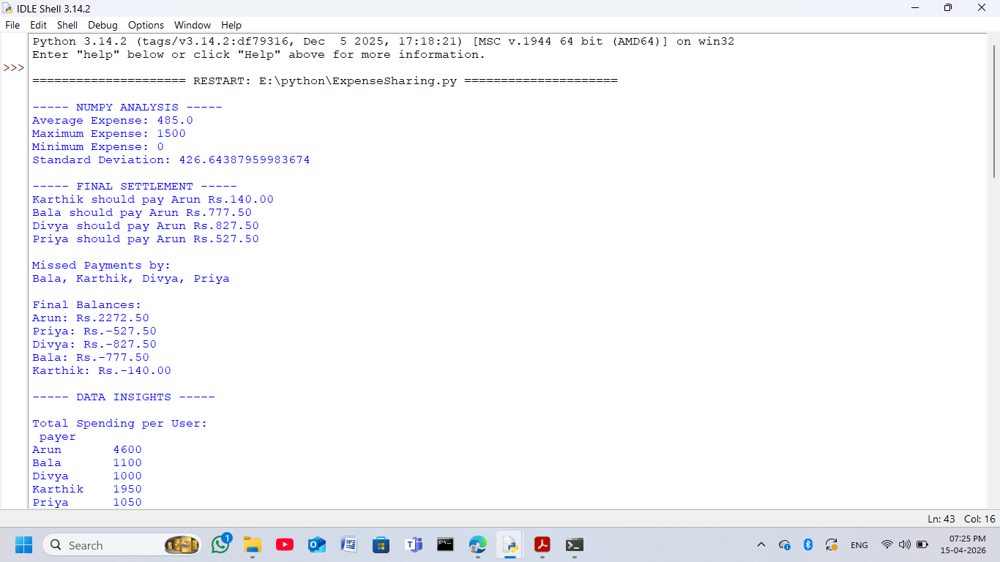
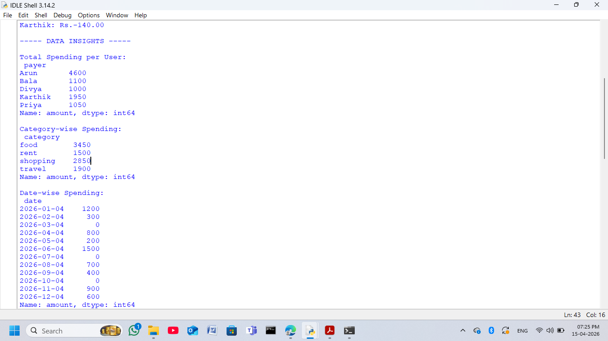
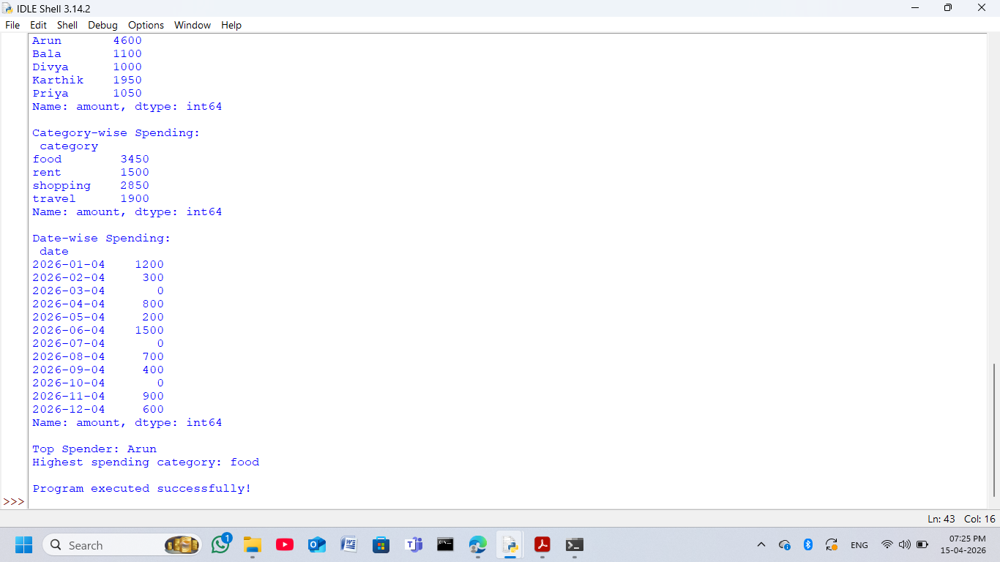
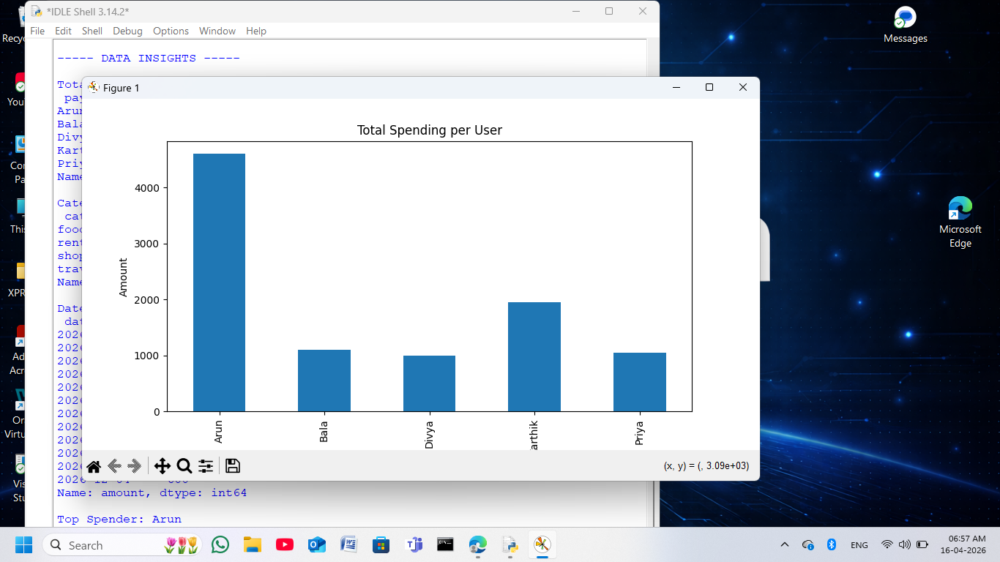
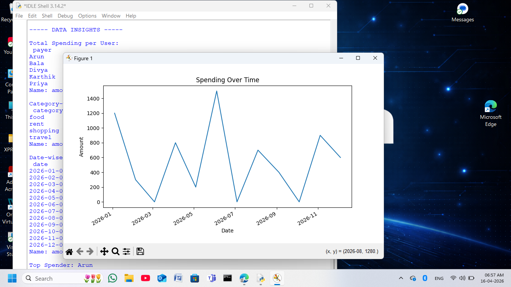
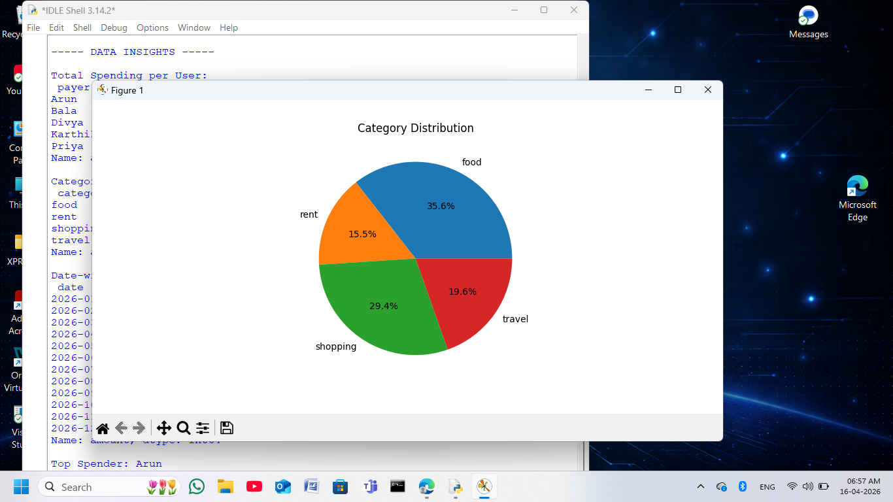

# Expense Sharing System (Google Pay Inspired)

### Developed by: Devanathan I

---

##  Overview
This project is a Python-based expense sharing system inspired by Google Pay. It helps users split expenses fairly and calculates settlements between participants. It also uses data science techniques to analyze and visualize spending patterns.

---

##  Dataset Description
The dataset consists of 20 transactions among 5 users:
- Arun
- Bala
- Divya
- Karthik
- Priya

Each transaction includes:
- Payer
- Amount
- Participants
- Date
- Category (food, rent, shopping, travel)

---

## Methodology

### Expense Splitting
- Each expense is equally divided among participants
- Payer gets a positive balance
- Participants get negative balances

### Settlement Logic
- Debtors (negative balance) pay creditors (positive balance)
- Minimum number of transactions is calculated

---

##  Data Processing
- Cleaned column names
- Converted data types (date, amount)
- Split participants into list format
- Handled missing values

---

##  Edge Cases
- Uneven payments
- Missed payments (amount = 0)
- Partial participation

---

##  NUMPY ANALYSIS OUTPUT



---

##  FINAL SETTLEMENT & BALANCES



---

##  DATA INSIGHTS



---

##  VISUALIZATIONS

### 🔹 Total Spending per User


---

### 🔹 Spending Over Time


---

### 🔹 Category Distribution


---

##  Key Insights
- Arun is the top spender
- Food category has highest spending
- Spending varies significantly over time
- Some users missed payments

---

##  Results
The system successfully:
- Calculates fair expense splitting
- Identifies missed payments
- Generates settlement transactions
- Provides insights and visualizations

---

##  Improvements
- Add weighted expense splitting
- Build mobile/web interface
- Store data in database

---

##  Challenges
- Handling multiple participants
- Managing missing payments
- Ensuring fair distribution

---

##  How to Run

1. Install libraries:
```
pip install pandas numpy matplotlib
```

2. Run program:
```
python ExpenseSharing.py
```

---

## 📂 Files Included
- ExpenseSharing.py
- expense.csv
- project_notebook.ipynb
- README.md
